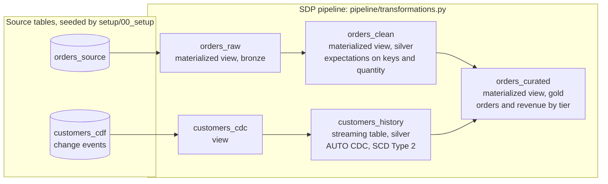
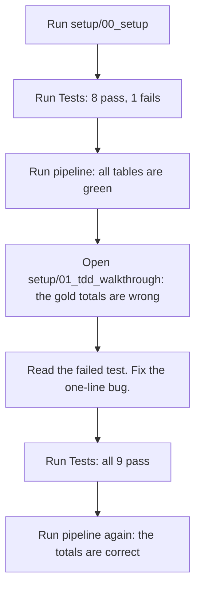

# SDP unit-testing quick-start

This repo has a small retail orders pipeline with a bug in it. The pipeline runs
green, but the gold table reports the wrong totals. You find the bug with a unit
test, fix one line, and watch all the tests pass.

This repo is the companion to the blog post [How to Unit Test Lakeflow Spark
Declarative Pipelines](https://community.databricks.com/t5/data-engineering/how-to-unit-test-spark-declarative-pipelines/td-p/172364). I checked all APIs against the public docs on
2026-10-07.

## The pipeline

The setup notebook seeds two source tables. The pipeline reads them and builds
four tables and one view.



| Table | What it does |
|-------|--------------|
| `orders_raw` | Reads `orders_source`. |
| `orders_clean` | Removes rows with no order ID or no customer ID. Stops the update if a quantity is not positive. Calculates `line_total`. |
| `customers_cdc` | Reads the customer change events. |
| `customers_history` | Keeps each version of each customer (AUTO CDC, SCD Type 2). Uses `sequence_num` to put late events in the correct order. |
| `orders_curated` | Joins each order to a customer tier. Counts the orders and adds the revenue for each tier. |

## The lesson



## Layout

```
setup/
  00_setup                    Run this first. It seeds the data and creates the pipeline.
  01_tdd_walkthrough          The lesson. Find the bug with the tests, then fix it.
  golden-prompt.md            Optional. Build the pipeline with Genie Code.
pipeline/
  transformations.py          The pipeline. See the diagram above.
  tests/
    test_transformations.py   Unit tests, AUTO CDC tests, and an expectations test.
```

## What you need

Unit testing is in Beta. You need:

1. Owner permission to create a pipeline.
2. `USE CATALOG` and `CREATE SCHEMA` on a catalog that you can write to.
3. Serverless compute in your workspace.

The setup notebook sets the PREVIEW channel, triggered mode, and the schema
`demo_sdp_unit_testing`.

## How to run

Use the setup notebook to create the pipeline. Do not use the "Create ETL
pipeline" wizard. The wizard starts a blank project and does not use the files
from Git.

1. Pull this repo into your workspace as a Git folder.
2. Open `pipeline/transformations.py`. Replace `<your_catalog>` with your catalog
   name.
3. Open `pipeline/tests/test_transformations.py`. Replace `<your_catalog>` with
   the same catalog name.
4. Open `setup/00_setup` and run all cells. In the `catalog` widget, enter the
   same catalog name.
5. Open the pipeline link that the last cell prints.
6. In the pipeline editor, open `pipeline/tests/test_transformations.py`. Click
   **Run Tests**. Eight tests pass and one test fails. The failed test shows the
   bug.
7. Click **Run pipeline**. All tables are green.
8. Open `setup/01_tdd_walkthrough`. Follow its steps to find and fix the bug.

The catalog must be the same in all three places. The test framework redirects
only fully qualified table names (`catalog.schema.table`). For this reason, the
code names each table in full.

The pipeline uses only `pipeline/transformations.py` as its source code. The
tests, the notebooks, and this README are not part of the pipeline. This is
correct.

## What each test proves

| Test | Table | Type | Proves |
|------|-------|------|--------|
| happy-path row count | `orders_clean` | unit | The transform keeps the valid rows. |
| computes line total | `orders_clean` | unit | `line_total` is `quantity` multiplied by `unit_price`. |
| null price yields null total | `orders_clean` | unit | A null price gives a null total, not 0. |
| drops rows missing keys | `orders_clean` | unit | The transform removes rows with no order ID or no customer ID. |
| output schema | `orders_clean` | unit | The output has the declared columns. |
| SCD2 current state | `customers_history` | integration | The current row is the event with the highest `sequence_num`. |
| SCD2 full history | `customers_history` | integration | The table keeps each version. |
| curated current-tier attribution | `orders_curated` | gold | Each order joins only to the current customer row. |
| expectation drops row | `orders_clean` | expectations | `expect_or_drop` removes a row with a null order ID. |

## Three rules for the tests

Follow these three rules. If you do not, the tests fail with errors that are hard
to read.

1. **Use the full table name.** The `test_spark` fixture redirects only fully
   qualified names to a temporary schema for each run. A short name goes to the
   session default catalog, and the read fails.
2. **List all tables in the chain.** `test_pipeline.run(test_spark, {...})`
   refreshes only the tables that you list. It does not build the tables upstream
   of them. List each table from the mock source to the table that you test. Do
   not list views. The framework includes views automatically.
3. **Check the run status.** `run()` returns a status. It does not raise an error
   when the update fails. The tests use a helper, `run_chain()`, that checks
   `status.is_success`. If the update fails, the helper shows `error_class` and
   `error_message`. Without this check, the test fails later with "table not
   found", and you do not see the real cause.

A test can call `run()` more than one time. For example, refresh the tables, add
rows to a source table, and refresh again. The Beta does not support a full
refresh.

Test runs use the pipeline compute. Databricks bills them as normal pipeline
updates.

## Clean up

When you finish:

1. Delete the `sdp-unit-testing` pipeline on the Jobs & Pipelines page.
2. Drop the demo schema:

```sql
DROP SCHEMA IF EXISTS <your_catalog>.demo_sdp_unit_testing CASCADE;
```

## Docs

- [Unit testing for pipelines](https://docs.databricks.com/aws/en/ldp/unit-testing)
- [AUTO CDC](https://docs.databricks.com/aws/en/ldp/cdc)
- [Expectations](https://docs.databricks.com/aws/en/ldp/expectations)

## Author

Lingeshwaran Kanniappan. Send questions or feedback on
[LinkedIn](https://www.linkedin.com/in/lingeshwarankanniappan/).
